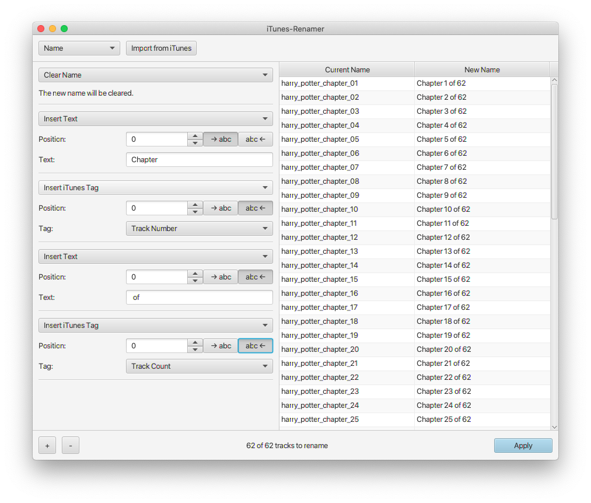
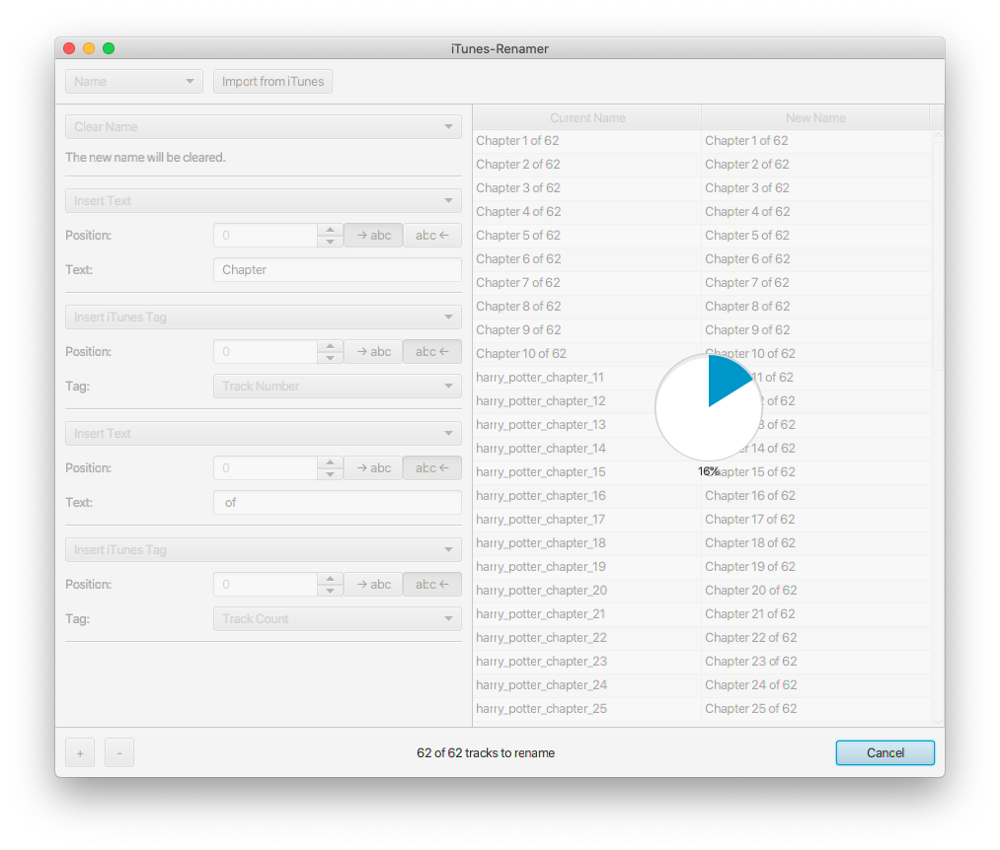
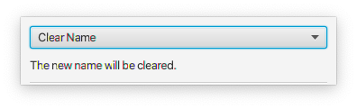
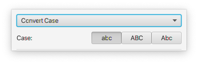
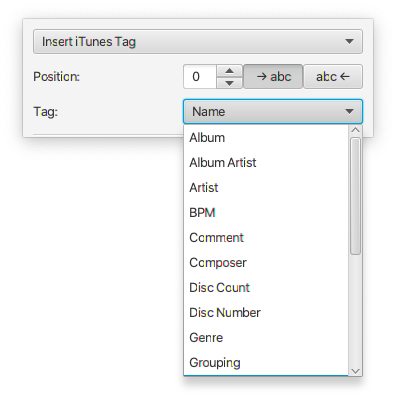
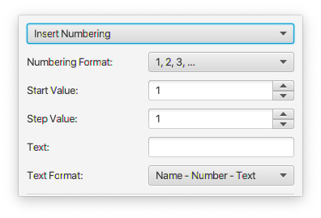
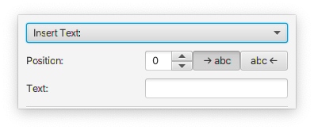
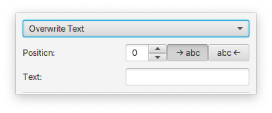
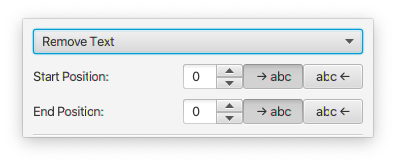
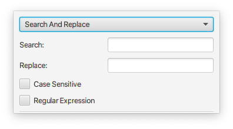

# iTunes-Renamer

A bulk renamer for iTunes media items.

## Screenshots




## How to use

The "Import from iTunes" button allows you to import tags from the items selected in iTunes.
The tag to import can be selected in the ComboBox next to it.
The following tags can be retrieved:
* Album
* Album Artist
* Artist
* BPM
* Comment
* Composer
* Disc Count
* Disc Number
* Genre
* Grouping
* Name
* Sort Album
* Sort Album Artist
* Sort Artist
* Sort Composer
* Sort Name
* Track Count
* Track Number
* Year

After the import, the renaming actions can be added.
To delete an action, it must be selected beforehand.
The rename actions are applied to each song in turn.
You can change the order of the actions by drag & drop.
In the table you can see the old and the new name of the songs.
The "Apply" button writes the new names back to the selected tag in iTunes.

## Renaming actions

### Clear Name



This action clears the current name.

### Convert Case



This action converts between UPPERCASE, lowercase and Start Case.

### Insert iTunes Tag



This action inserts tags loaded from iTunes.
You can specify the position where the tags are inserted.

### Insert Numbering



This action inserts a numbering and an optional additional text.
You can specify the numbering format, start value and step value.
You can also define the order in which the old name, numbering and additional text will be arranged.
The following numbering formats can be selected:
* 1, 2, 3, ...
* 01, 02, 03, ...
* 001, 002, 003, ...
* 0001, 0002, 0003, ...
* 00001, 00002, 00003, ...
* 000001, 000002, 000003, ...
* 0000001, 0000002, 0000003, ...
* 00000001, 00000002, 00000003, ...
* 000000001, 000000002, 000000003, ...

### Insert Text



This action inserts characters.
You can specify the position where the characters are inserted.

### Overwrite Text



This action overwrites characters.
You can specify the position from which the characters are overwritten.

### Remove Text



This action removes characters.
You can specify the area where the characters will be deleted.

### Search And Replace



This action allows you to search and replace.
You can enable case-sensitive search.
You can also enable search and replace with regular expressions.

## Build

iTunes-Renamer is a Maven project.

Run the source as a JavaFX application:

```
mvn clean javafx:run
```

Build an executable jar from the source:

```
mvn clean compile package
```

Build a native application using the createPackage.sh script:

```
mvn clean install
```

## Credits

<div>Icons made by <a href="https://www.freepik.com" title="Freepik">Freepik</a> from <a href="https://www.flaticon.com/" title="Flaticon">www.flaticon.com</a></div>
